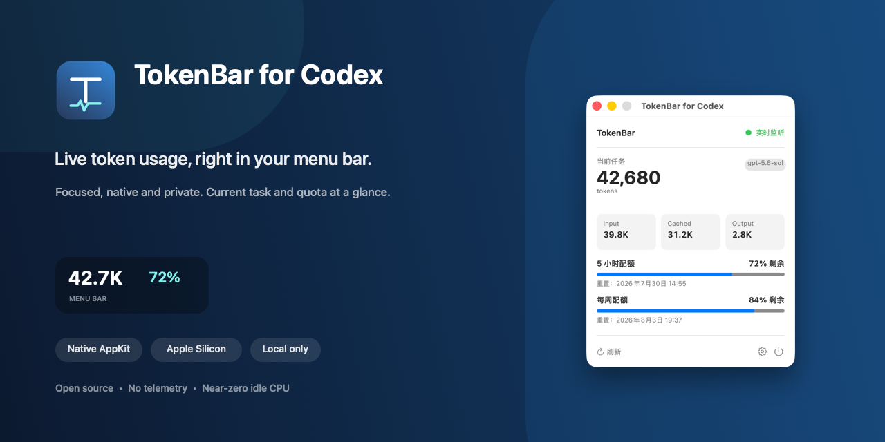

# TokenBar for Codex

<p align="center">
  
</p>

<p align="center">
  <a href="https://github.com/sang-ran/TokenBar-for-Codex/actions/workflows/build.yml"></a>
  &nbsp; · &nbsp;
  <a href="https://github.com/sang-ran/TokenBar-for-Codex/releases"><strong>下载最新 Alpha 版</strong></a>
  &nbsp; · &nbsp;
  <a href="README.md">English</a>
</p>

TokenBar 是一个轻量、原生的 macOS 菜单栏应用，用于随时查看当前 Codex
任务的 Token 用量与账号配额。

它不占用 Dock，只把真正有用的数字放在菜单栏。没有多服务商框架、费用
数据库、浏览器自动化、桌面组件或额外后台守护进程。

> [!IMPORTANT]
> TokenBar for Codex 是独立开源项目，与 OpenAI 无隶属、背书或维护关系。

## 为什么选择 TokenBar

- **无需点击也能看到：** 当前 Token 与配额可以常驻菜单栏。
- **响应及时：** 任务活跃时约每 0.4 秒检查一次新的 Token 事件。
- **功能聚焦：** 一个原生小应用，没有第三方运行时依赖。
- **注重隐私：** 不包含统计分析、广告、遥测或更新跟踪。

## 功能

- 实时显示当前 Codex 任务的 Token 数量
- 显示 Input、Cached Input 和 Output 明细
- 订阅账号显示 5 小时及每周剩余配额
- API Key 账号自动切换为仅 Token 模式
- 菜单栏单行、双行两种样式
- 可选的低配额警告颜色
- 可选登录时自动启动
- 纯 AppKit 实现，无第三方依赖

上方截图使用 Debug 专用 QA 模式生成的匿名示例数据。

## 性能

在开发使用的 Apple Silicon Mac 上，典型空闲实测接近 `0%` CPU、物理
内存约 `24 MB`。实际数值会随 macOS、Codex 活跃程度和系统环境变化。

## 系统要求

- Apple Silicon（M 系列芯片）Mac
- macOS 14 Sonoma 或更高版本
- 已登录并至少使用过一次的 Codex 桌面版或 Codex CLI

安装预编译版本**不需要 Xcode**。

## 安装

1. 从 [Releases](https://github.com/sang-ran/TokenBar-for-Codex/releases)
   下载 `TokenBar-for-Codex-v0.1.0-alpha.zip` 及对应的 `.sha256` 文件。
2. 计算压缩包的 SHA-256，并与 Release 页面公布的值核对：

   ```bash
   shasum -a 256 TokenBar-for-Codex-v0.1.0-alpha.zip
   ```

3. 解压后将 **TokenBar for Codex.app** 移入“应用程序”文件夹。
4. 当前 Alpha 尚未经过 Apple 公证。第一次运行请按住 Control 点击应用，
   再选择“打开”。

应用不会显示 Dock 图标，Token 数量会直接出现在 macOS 菜单栏。

## 刷新机制

TokenBar 增量读取 `~/.codex` 中当前任务的 Token 事件，不会在每次刷新时
重新扫描整个日志。任务活跃时约每 0.4 秒检查一次；空闲后最长每 1 秒
检查一次，在响应速度和资源占用之间保持平衡。

订阅账号的配额通过本机 Codex 的只读 app-server 每 5 分钟刷新一次，
弹窗内也可手动刷新。API Key 账号没有订阅配额窗口，因此会自动隐藏配额。

## 隐私

TokenBar 在本机处理 Codex 用量信息，对话内容不会发送给开发者。准确的
数据流与限制说明见 [PRIVACY.md](PRIVACY.md)。

## 常见问题

- **菜单栏显示 `—`：** 打开 Codex，开始或继续一个任务，等待第一个
  Token 事件产生。
- **没有显示配额：** API Key 账号只显示 Token，这是正常行为。
- **配额暂不可用：** 点击刷新，并确认本机 Codex 应用或 CLI 已登录。
- **macOS 阻止打开：** 按住 Control 点击应用并选择“打开”。完成
  Developer ID 公证发布后将不再需要这个步骤。

反馈问题时，请勿上传对话日志、账号凭据或 `~/.codex` 中的内容。

## 从源码构建

需要 Swift 5.10 或更高版本：

```bash
swift test
Scripts/package.sh release
open ".build/TokenBar for Codex.app"
```

默认打包会生成一个仅支持 arm64、使用 ad-hoc 签名的应用。
`Scripts/create_archive.sh` 可以生成不包含 `__MACOSX` 元数据的干净
压缩包。Developer ID 签名、Apple 公证与后续 Homebrew Cask 的维护说明见
[DISTRIBUTION.md](DISTRIBUTION.md)。

Debug 构建还提供了使用匿名示例数据的 QA 窗口，便于重复截图和检查 UI：

```bash
swift build
".build/debug/TokenBar" --qa-window
```

## 当前状态

`v0.1.0-alpha` 是首个公开测试版本。Codex 的本地存储与 app-server
接口并非公开的兼容性承诺，后续 Codex 更新可能需要 TokenBar 同步适配。

## 参与贡献

欢迎提交问题和目标明确的 Pull Request。请先阅读
[CONTRIBUTING.md](CONTRIBUTING.md)，并且不要在公开 Issue 中附带对话内容、
账号凭据或本地 Codex 日志。

## 许可证

[MIT](LICENSE)
